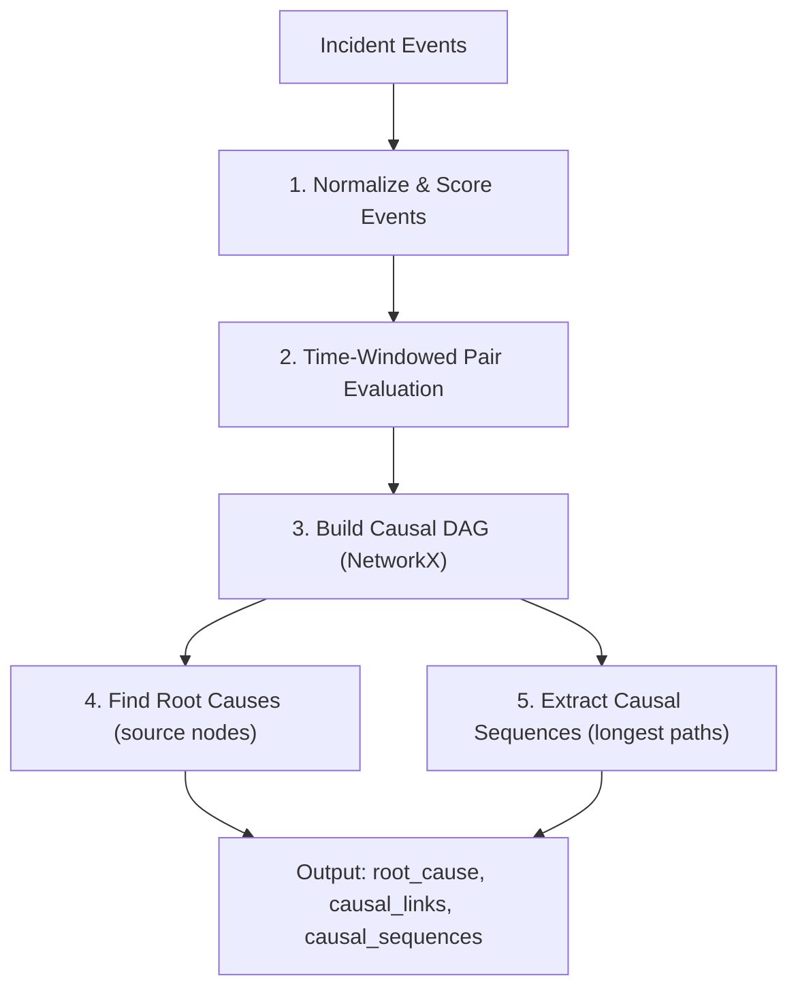

# Fix Event Correlation, Root Cause Detection & Sequence Extraction

## Problem Statement

The pipeline currently **cannot properly detect incidents** due to compounding issues across every stage:

1. **Schema conversion fallback** merges all log lines into a single giant event instead of splitting them into individual events
2. **Timeline clustering** only groups same-device events → misses cross-device cascading failures
3. **Causal inference** uses O(n²) all-pairs with hardcoded rules, no proper graph, and no sequence extraction
4. **Downstream consumers** have field-name mismatches making reports/dashboard show zeros

The sample output proves this: 20 distinct log lines became **1 event** → **1 incident** → **0 causal links** → root cause is "SNMP" with score **-1.0**. Nothing works.

## Proposed Changes

### Phase 1: Fix Event Splitting (Critical Foundation)

The fallback extractor in `integrated_pipeline.py` splits on blank lines (`\n\n`), which fails for syslog where each line is a separate event. This must be fixed first — everything downstream depends on getting individual events.

---

#### [MODIFY] [integrated_pipeline.py](file:///c:/Users/revan/Downloads/Projects/HPE_CPP/Networking-Incident-Project-HPE-CPP/integrated_pipeline.py)

**Change the fallback extractor** (L55-107) to split on **individual lines first**, not blank lines:

```python
# Current (broken): splits on blank lines, merges all syslog into 1 chunk
chunks = [c.strip() for c in text.split("\n\n") if c.strip()]
if not chunks:
    chunks = [l.strip() for l in text.splitlines() if l.strip()]
```

**Fix**: Reverse the priority — try individual lines first (which is correct for syslog), fall back to paragraph-split only if lines look like multi-line entries:

```python
# Split into individual lines first (correct for syslog)
lines = [l.strip() for l in text.splitlines() if l.strip()]

# Heuristic: if most lines start with a timestamp-like pattern, treat each as a separate event
# Otherwise fall back to paragraph splitting for multi-line log formats
import re
ts_pattern = re.compile(r'^(\d{4}-\d{2}-\d{2}|[A-Z][a-z]{2}\s+\d+\s+\d{2}:)')
ts_lines = sum(1 for l in lines if ts_pattern.match(l))

if ts_lines >= len(lines) * 0.5:
    chunks = lines  # Each line is a separate event
else:
    chunks = [c.strip() for c in text.split("\n\n") if c.strip()]
    if not chunks:
        chunks = lines
```

---

### Phase 2: Redesign Timeline Clustering

#### [MODIFY] [timeline_reconstruction.py](file:///c:/Users/revan/Downloads/Projects/HPE_CPP/Networking-Incident-Project-HPE-CPP/timeline_reconstruction.py)

Replace the single-pass single-device clustering with a **two-phase approach**:

**Phase A — Device-Level Clustering** (keep existing, mostly unchanged):
Groups events on the same device into device-local incident clusters. This stays the same.

**Phase B — Cross-Device Correlation** (NEW):
Merge device-level clusters that are causally related across devices.

**Cross-device correlation signals** (any 2+ of these triggers a merge):

| Signal | How to detect | Weight |
|--------|--------------|--------|
| Shared IP in messages | BGP neighbor IP on device A = device B's IP | 0.4 |
| Temporal overlap | Clusters have overlapping or close time windows (≤ 5 min gap) | 0.2 |
| Compatible domains | `physical_link` on A + `routing` on B | 0.2 |
| Same VLAN/subnet | Events reference the same VLAN ID | 0.15 |
| Severity escalation | Lower severity on A, higher on B, B starts after A | 0.15 |

**Merge threshold**: Combined score ≥ 0.5

**Cap**: Maximum 50 events per super-incident to prevent runaway merging.

```python
def correlate_cross_device(clusters, merge_threshold=0.5, max_events=50):
    """Phase B: Merge device-level clusters across devices."""
    
    # Build IP→device index from events for fast cross-device lookup
    ip_to_clusters = defaultdict(set)  # IP mentioned in events → cluster indices
    
    for idx, cluster in enumerate(clusters):
        for event in cluster:
            # Extract IPs from messages
            ips = re.findall(r'\b\d+\.\d+\.\d+\.\d+\b', text_of(event))
            for ip in ips:
                ip_to_clusters[ip].add(idx)
    
    # Evaluate cluster pairs for cross-device correlation
    merged = UnionFind(len(clusters))
    
    for i in range(len(clusters)):
        for j in range(i+1, len(clusters)):
            if clusters[i][0].get("device") == clusters[j][0].get("device"):
                continue  # Same device already handled in Phase A
            
            score = compute_cross_device_score(clusters[i], clusters[j], ip_to_clusters)
            if score >= merge_threshold:
                # Check size cap
                combined = merged.size(i) + merged.size(j)
                if combined <= max_events:
                    merged.union(i, j)
    
    # Build merged super-clusters
    groups = defaultdict(list)
    for idx in range(len(clusters)):
        groups[merged.find(idx)].extend(clusters[idx])
    
    return [sorted(events, key=event_time) for events in groups.values()]
```

**Scalability**: The cluster-level comparison is O(C²) where C = number of clusters, not events. With typical datasets producing 10-100 clusters, this is fast. The IP index makes cross-device lookup O(1).

---

### Phase 3: Rebuild Causal Inference with DAG + Sequence Extraction

This is the core change. Replace the flat all-pairs scoring with a **proper directed acyclic graph (DAG)** using NetworkX.

#### [MODIFY] [causalInference.py](file:///c:/Users/revan/Downloads/Projects/HPE_CPP/Networking-Incident-Project-HPE-CPP/causalInference/causalInference.py)

**New architecture:**



**Key changes:**

##### 3a. Time-Windowed Comparison (replaces O(n²))

Instead of comparing every event pair, use a **sliding time window**:

```python
def build_causal_graph(events, window_sec=1800):
    """Build causal DAG using time-windowed comparison. O(n × w) instead of O(n²)."""
    G = nx.DiGraph()
    
    sorted_events = sorted(events, key=lambda e: parse_dt(get_time(e)))
    
    for e in sorted_events:
        G.add_node(e["event_uid"], **e)
    
    # For each event, only compare with events within the time window ahead
    for i, a in enumerate(sorted_events):
        ta = parse_dt(get_time(a))
        
        for j in range(i + 1, len(sorted_events)):
            b = sorted_events[j]
            tb = parse_dt(get_time(b))
            lag = (tb - ta).total_seconds()
            
            if lag > window_sec:
                break  # All subsequent events are beyond the window
            
            conf, reason = relation(a, b)
            if conf > 0:
                G.add_edge(
                    a["event_uid"], b["event_uid"],
                    confidence=conf, lag_seconds=lag, reason=reason
                )
    
    return G
```

**Complexity**: O(n × w) where w = average events in window. For 10,000 events with 30-min windows containing ~50 events each, this is ~500K comparisons vs 50M for all-pairs.

##### 3b. Network Layer Hierarchy Scoring (new)

Add a **layer-aware** causality model. Failures propagate **upward** through network layers:

```python
LAYER = {
    "power": 0, "fan": 0,                              # L0: Physical/Environmental
    "crc_errors": 1, "interface_down": 1,               # L1: Physical Link
    "interface_up": 1, "transceiver": 1,
    "stp_topology_change": 2, "vlan": 2, "lldp": 2,    # L2: Data Link
    "mac_auth_success": 2, "dot1x_failure": 2,
    "ospf": 3, "bgp": 3,                               # L3: Routing
    "config_change": 3,
    "ssh_bruteforce": 4, "admin_auth_failure": 4,       # L4+: Application/Security
}

# In relation():
layer_a = LAYER.get(sa, 2)
layer_b = LAYER.get(sb, 2)
if layer_a < layer_b:
    score += 0.2   # Lower layer → higher layer = natural propagation
    reasons.append(f"L{layer_a}→L{layer_b} propagation")
elif layer_a > layer_b:
    score -= 0.15  # Higher→lower is unusual (but not impossible)
```

##### 3c. Recovery Event Penalization (fix)

```python
RECOVERY_EVENTS = {"interface_up", "bgp", "ospf", "fan", "power", "ntp"}
RECOVERY_KEYWORDS = {"established", "up", "on-line", "online", "restored", "synchronized", "forwarding"}

def is_recovery(e):
    st = subtype(e)
    s = text(e)
    if st in RECOVERY_EVENTS and any(kw in s for kw in RECOVERY_KEYWORDS):
        return True
    return False

# In root_score():
if is_recovery(e):
    score -= 60  # Heavy penalty — recovery events are never root causes
```

##### 3d. Causal Sequence Extraction (NEW — the key deliverable)

Use the DAG to extract **ordered causal chains** — this is what the user is asking for:

```python
def extract_causal_sequences(G):
    """Extract causal sequences from the DAG.
    
    A causal sequence is a path from a root cause (source node)
    to a terminal effect (sink node), ordered by causality.
    """
    sequences = []
    
    # Find root cause candidates: source nodes with no incoming edges
    root_nodes = [n for n in G.nodes() if G.in_degree(n) == 0 and G.out_degree(n) > 0]
    
    # Find terminal effects: sink nodes with no outgoing edges
    leaf_nodes = [n for n in G.nodes() if G.out_degree(n) == 0 and G.in_degree(n) > 0]
    
    # For each root, find the longest path to any leaf (= most complete causal chain)
    for root in root_nodes:
        best_path = []
        for leaf in leaf_nodes:
            try:
                # Find all simple paths (bounded to prevent explosion)
                for path in nx.all_simple_paths(G, root, leaf, cutoff=10):
                    if len(path) > len(best_path):
                        best_path = path
            except nx.NetworkXNoPath:
                continue
        
        if len(best_path) >= 2:
            # Build sequence with step details
            sequence = []
            for step_idx, node_id in enumerate(best_path):
                node_data = G.nodes[node_id]
                role = "root_cause" if step_idx == 0 else (
                    "terminal_effect" if step_idx == len(best_path) - 1 else
                    "propagation"
                )
                
                # Get edge data for the link to this node
                edge_data = {}
                if step_idx > 0:
                    edge_data = G.edges[best_path[step_idx-1], node_id]
                
                sequence.append({
                    "step": step_idx + 1,
                    "event_uid": node_id,
                    "role": role,
                    "device": node_data.get("device"),
                    "subtype": node_data.get("normalized_subtype"),
                    "severity": node_data.get("severity"),
                    "message": node_data.get("message"),
                    "timestamp": str(node_data.get("corrected_time") or node_data.get("event_time")),
                    "confidence_from_previous": edge_data.get("confidence"),
                    "lag_from_previous": edge_data.get("lag_seconds"),
                    "reason": edge_data.get("reason"),
                })
            
            sequences.append({
                "sequence_id": f"SEQ-{len(sequences)+1:03d}",
                "root_event": best_path[0],
                "terminal_event": best_path[-1],
                "length": len(best_path),
                "total_confidence": sum(
                    G.edges[best_path[i], best_path[i+1]].get("confidence", 0)
                    for i in range(len(best_path)-1)
                ) / (len(best_path) - 1),
                "steps": sequence,
            })
    
    # Sort by length (longest chains first) then by confidence
    sequences.sort(key=lambda s: (s["length"], s["total_confidence"]), reverse=True)
    return sequences
```

##### 3e. New Output Schema

```json
{
  "incident_id": "INC-0001",
  "classification": "actionable",
  "event_count": 12,
  "root_cause": { /* highest-scored source node */ },
  "causal_links": [ /* all DAG edges with confidence */ ],
  "causal_sequences": [
    {
      "sequence_id": "SEQ-001",
      "root_event": "evt-3",
      "terminal_event": "evt-11",
      "length": 4,
      "total_confidence": 0.82,
      "steps": [
        {"step": 1, "role": "root_cause",      "subtype": "interface_down", "device": "Switch-A"},
        {"step": 2, "role": "propagation",      "subtype": "stp_topology_change", "device": "Switch-A"},
        {"step": 3, "role": "propagation",      "subtype": "bgp_neighbor_down", "device": "Router-B"},
        {"step": 4, "role": "terminal_effect",  "subtype": "ospf_neighbor_down", "device": "Router-B"}
      ]
    }
  ],
  "unlinked_events": [ /* events not in any causal chain */ ],
  "source": "dag-production-rules"
}
```

---

### Phase 4: Fix Downstream Consumers

#### [MODIFY] [network_incident_summarizer.py](file:///c:/Users/revan/Downloads/Projects/HPE_CPP/Networking-Incident-Project-HPE-CPP/network_incident_summarizer.py)

Fix the field name mismatches:

```diff
- if link.get("cause_id") == event_id:
+ if link.get("source_event_uid") == event_id:
- if link.get("effect_id") == event_id:
+ if link.get("target_event_uid") == event_id:
```

---

#### [MODIFY] [streamlit_app.py](file:///c:/Users/revan/Downloads/Projects/HPE_CPP/Networking-Incident-Project-HPE-CPP/streamlit_app.py)

Fix metric keys and add causal sequences tab:

```diff
- col3.metric("🔗 Causal Links", causal_output.get("num_causal_links", 0))
+ col3.metric("🔗 Causal Links", causal_output.get("total_causal_links", 0))
- col4.metric("🚀 Incident Flows", causal_output.get("num_flows", 0))
+ col4.metric("🚀 Incidents", causal_output.get("total_incidents", 0))
```

Fix causal links table column names to match actual output keys. Add a new **Causal Sequences** section showing the extracted chains.

---

#### [MODIFY] [preprocessing.py](file:///c:/Users/revan/Downloads/Projects/HPE_CPP/Networking-Incident-Project-HPE-CPP/preprocessing.py)

Remove the inline duplicate timestamp normalization (L286-312) and call the existing `normalize_timestamps()` function instead.

---

## Scalability Analysis

| Log Size | Current (O(n²)) | New (Time-Windowed DAG) |
|----------|------------------|------------------------|
| 100 events | 4,950 pairs | ~2,500 pairs |
| 1,000 events | 499,500 pairs | ~25,000 pairs |
| 10,000 events | 49,995,000 pairs | ~250,000 pairs |
| 100,000 events | ~5 billion pairs ❌ | ~2.5M pairs ✅ |

The sliding window `break` ensures we never compare events more than `window_sec` apart. For typical network logs with 30-minute incident windows, this reduces comparisons by **100-1000×**.

The NetworkX DAG operations (path finding, topological sort) are O(V + E) which is linear in the graph size.

---

## Verification Plan

### Automated Tests

```bash
# Run the full pipeline on the existing test data
python integrated_pipeline.py --input logs.txt --output-dir pipeline_output --no-llm

# Verify schema_output.json has individual events (not 1 giant event)
python -c "import json; d=json.load(open('pipeline_output/schema_output.json')); print(f'Events: {len(d)}')"

# Verify timeline produces multiple incidents
python -c "import json; d=json.load(open('pipeline_output/timeline_output.json')); print(f'Incidents: {len(d)}')"

# Verify causal output has sequences
python -c "import json; d=json.load(open('pipeline_output/causal_inference_output.json')); print(f'Links: {d[\"total_causal_links\"]}, Sequences: {sum(len(i.get(\"causal_sequences\",[])) for i in d[\"incidents\"])}')"
```

### Manual Verification

- Inspect `causal_sequences` in the output — each sequence should show a plausible `root_cause → propagation → terminal_effect` chain
- Verify that cross-device events (e.g., BGP neighbor down on device A referencing device B's IP) are correlated into the same incident
- Check that recovery events (`interface_up`, `BGP established`) are NOT identified as root causes

## Open Questions

> [!IMPORTANT]
> **Cross-device merge threshold**: I proposed 0.5 — should this be configurable via CLI flag? A higher threshold means fewer cross-device merges (more conservative), lower means more aggressive grouping.

> [!IMPORTANT]
> **Sequence cutoff**: I set `cutoff=10` for path finding to prevent explosion in dense graphs. For very complex incidents with long propagation chains (>10 hops), should this be higher?
