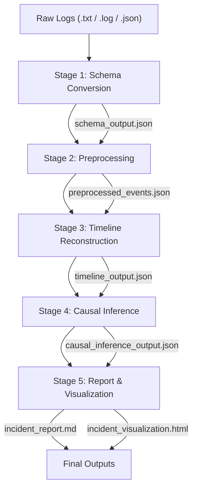
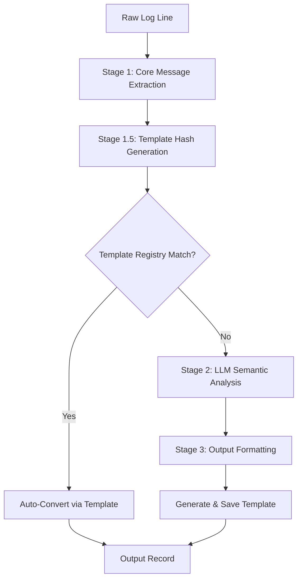
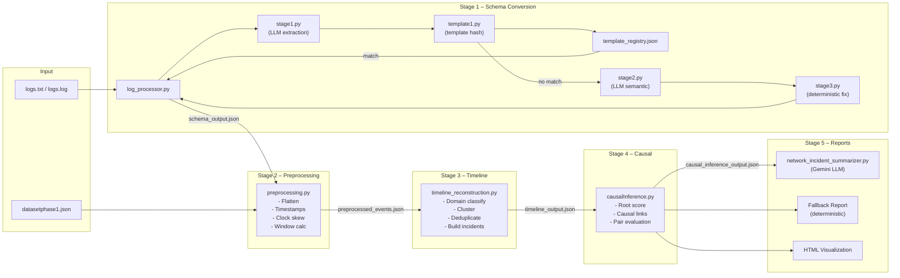

# Networking Incident Project — HPE CPP

## Complete Walkthrough

> [!NOTE]
> This document covers every file, every pipeline stage, the data flow between them, and the purpose of each component.

---

## 1. Project Overview

This project is an **end-to-end Network Incident Reconstruction and Root Cause Analysis (RCA) system**. It takes raw network logs (syslogs, authentication events, routing events, etc.) from multi-vendor devices and automatically:

1. Converts unstructured logs → structured schema events (Schema Conversion)
2. Preprocesses and normalizes events (Preprocessing)
3. Clusters events into incident timelines (Timeline Reconstruction)
4. Infers causal chains and root causes (Causal Inference)
5. Generates human-readable reports (Report Generation)
6. Produces HTML visualization dashboards (Visualization)



---

## 2. Entry Points — How to Run the System

The project offers **three entry points**:

### 2.1 CLI — [integrated_pipeline.py](file:///c:/Users/revan/Downloads/Projects/HPE_CPP/Networking-Incident-Project-HPE-CPP/integrated_pipeline.py)

The primary entry point. Orchestrates the full 5-stage pipeline from the command line.

```bash
python integrated_pipeline.py --input logs.txt --output-dir pipeline_output
```

| Flag | Purpose |
|------|---------|
| `--input` | Path to input log file (`.txt`, `.log`, or `.json`) |
| `--output-dir` | Output directory (default: `pipeline_output`) |
| `--no-llm` | Disable LLM-powered report generation |

### 2.2 REST API — [app.py](file:///c:/Users/revan/Downloads/Projects/HPE_CPP/Networking-Incident-Project-HPE-CPP/app.py)

A Flask web server that exposes the pipeline via HTTP upload.

| Endpoint | Method | Purpose |
|----------|--------|---------|
| `/health` | GET | Health check |
| `/analyze` | POST | Upload a log file (multipart `file` field), triggers full pipeline |

- Accepts `.txt`, `.log`, `.json` files
- Optional query param `?no_llm=true` to disable LLM report
- Saves output under `pipeline_output/<filename_stem>/`

### 2.3 Streamlit Dashboard — [streamlit_app.py](file:///c:/Users/revan/Downloads/Projects/HPE_CPP/Networking-Incident-Project-HPE-CPP/streamlit_app.py)

An interactive dashboard for viewing pipeline results. Has 5 tabs:

| Tab | Content |
|-----|---------|
| 📊 Overview | Summary metrics: incidents, events, causal links, devices |
| 🔄 Schema Conversion | Table of schema-converted events |
| ⏱️ Timeline Reconstruction | Incident summaries + drill-down into events |
| 🔗 Causal Inference | Root causes, causal links, affected devices |
| 📋 Incident Report | Full markdown report viewer |

---

## 3. Pipeline Stage 1: Schema Conversion

**Goal**: Convert raw, unstructured log lines into a structured nested JSON schema.

**Input**: Raw `.txt`/`.log` file or pre-structured `.json`
**Output**: `schema_output.json` — array of structured event records

### Architecture

The schema conversion is a multi-sub-stage pipeline managed by [log_processor.py](file:///c:/Users/revan/Downloads/Projects/HPE_CPP/Networking-Incident-Project-HPE-CPP/schema_conversion/log_processor.py):



---

### 3.1 Sub-Stage 1: Core Message Extraction — [stage1.py](file:///c:/Users/revan/Downloads/Projects/HPE_CPP/Networking-Incident-Project-HPE-CPP/schema_conversion/stage1.py)

**Class**: `FewShotLLMLogExtractor`

**What it does**:
1. **Timestamp Extraction** — Uses regex patterns to extract ISO-8601 or syslog-style timestamps from the log line
2. **Few-Shot LLM Prompting** — Sends the log to a local Ollama LLM (`qwen2.5:14b`) with 4 curated examples to extract:
   - `hostname` — device identifier
   - `ip` — IP address
   - `vendor` — equipment vendor (Cisco, HPE, Aruba, etc.)
   - `os` — operating system family
   - `core_message` — the actual event description stripped of headers/metadata
3. **Validation** — Ensures extracted fields are not empty placeholders

**LLM**: Calls a local Ollama instance at `http://localhost:11434/api/generate` with temperature=0 for determinism.

---

### 3.2 Sub-Stage 1.5: Template Matching — [template1.py](file:///c:/Users/revan/Downloads/Projects/HPE_CPP/Networking-Incident-Project-HPE-CPP/schema_conversion/template1.py)

**Class**: `SemanticTemplateGenerator`

**What it does**:
1. **Entity Detection** — LLM identifies dynamic parts of the log (IPs, VLANs, interfaces, etc.) and assigns them semantic placeholders (`<IP>`, `<VLAN>`, `<IFACE>`, etc.)
2. **Template Generation** — Replaces dynamic values with placeholders to create a canonical template (e.g., `OSPF neighbor <IP> on VLAN <VLAN> changed state from FULL to DOWN`)
3. **Regex Generation** — Converts the template into a regex pattern with named capture groups
4. **Fingerprinting** — SHA-256 hash of the template for fast registry lookup

**Supported Placeholders**: `<IP>`, `<VLAN>`, `<MAC>`, `<IFACE>`, `<INSTANCE_ID>`, `<PROCESS_ID>`, `<VNI_ID>`, `<COUNT>`, `<PERCENT>`, `<DURATION>`, `<SECONDS>`, `<VPN_NAME>`, `<AGGREGATE>`, `<NAMESPACE>`, `<SERVICE>`, `<FQDN>`, `<USER>`, `<LACP_STATE>`, `<NUM>`

---

### 3.3 Template Registry — [template2.py](file:///c:/Users/revan/Downloads/Projects/HPE_CPP/Networking-Incident-Project-HPE-CPP/schema_conversion/template2.py) + [template_registry.json](file:///c:/Users/revan/Downloads/Projects/HPE_CPP/Networking-Incident-Project-HPE-CPP/schema_conversion/template_registry.json)

**Purpose**: A persistent cache of known log patterns. If a new log matches a cached template hash, the expensive LLM calls (Stage 2) are skipped entirely.

**How it works**:
1. Loads existing `template_registry.json`
2. Merges new templates from `template1_output.json`
3. Enriches with schema data from `output.json` (Stage 3 output)
4. Deduplicates by template hash
5. Saves updated registry

**Optimization**: Template-matched logs bypass LLM analysis completely → massive speed improvement for recurring log patterns.

---

### 3.4 Sub-Stage 2: Semantic Analysis — [stage2.py](file:///c:/Users/revan/Downloads/Projects/HPE_CPP/Networking-Incident-Project-HPE-CPP/schema_conversion/stage2.py)

**Class**: `CoreMessageSemanticAnalyzer`

**What it does** (only for logs without a template match):
1. Takes the `core_message` from Stage 1
2. Calls Ollama LLM with a detailed prompt to classify:
   - **type** — `routing`, `security`, `system`, `interface`, `overlay`, `fabric`, `storage`, `orchestration`, `time`, `generic`
   - **subtype** — `bgp`, `ospf`, `interface_down`, `authentication_failure`, etc.
   - **severity** — `info`, `warning`, `error`, `critical`
   - **interface_id** — extracted only if explicitly present
   - **canonical_event_msg** — deterministic `<object>_<action>` format (e.g., `interface_down`, `bgp_neighbor_up`)

**Key design**: The prompt enforces **deterministic normalization** — semantically identical logs *must* produce the same `canonical_event_msg` regardless of vendor-specific wording.

---

### 3.5 Sub-Stage 3: Output Formatting — [stage3.py](file:///c:/Users/revan/Downloads/Projects/HPE_CPP/Networking-Incident-Project-HPE-CPP/schema_conversion/stage3.py)

**What it does**:
1. Takes Stage 2 output and applies **deterministic corrections** to fix LLM classification errors
2. Uses regex-based rules to override type/subtype/severity based on known patterns in the raw log:
   - `snmpd` in process name → `service/snmp`
   - `power supply` or `psu` → `hardware/power`
   - `off-line` or `link down` → `physical_link/interface_down`
   - `topology change` or `mstp` → `topology/stp_topology_change`
   - `ssh login failed` → `security/ssh_bruteforce`
   - etc.
3. Extracts `interface_id` and `vlan` via regex from raw log + message
4. Extracts syslog facility and severity from `[facility.severity]` brackets
5. Formats output into the final nested JSON schema

**Output schema** per event:
```json
{
  "event": { "event_uid", "event_id", "type", "subtype", "severity", "message" },
  "device": { "hostname", "ip", "vendor", "os" },
  "network": { "interface_id", "vlan" },
  "timestamps": { "event_time" },
  "raw": { "message" }
}
```

---

### 3.6 LogProcessor — The Orchestrator — [log_processor.py](file:///c:/Users/revan/Downloads/Projects/HPE_CPP/Networking-Incident-Project-HPE-CPP/schema_conversion/log_processor.py)

**Class**: `LogProcessor` (1007 lines)

This is the **unified orchestrator** for the schema conversion pipeline. For each log line it:

1. Calls Stage 1 (`process_stage1_single_log`) — extracts core message
2. Calls Template1 (`generate_template_single_log`) — generates template hash
3. Checks template registry (`match_template`) — looks for hash match
4. **If match found**: Auto-converts using stored schema (`auto_convert_to_schema`) → **fast path**
5. **If no match**: Runs Stage 2 (`process_stage2_single_log`) → Stage 3 (`process_stage3_single_log`) → adds new template to registry

**`no_llm` mode**: When enabled (for offline runs), skips all LLM calls and produces minimal records with the raw log as the message.

**Statistics tracked**: total processed, template-matched (fast), requires LLM, errors.

---

## 4. Pipeline Stage 2: Preprocessing — [preprocessing.py](file:///c:/Users/revan/Downloads/Projects/HPE_CPP/Networking-Incident-Project-HPE-CPP/preprocessing.py)

**Input**: `schema_output.json`
**Output**: `preprocessed_events.json`

The preprocessing pipeline performs 4 transformations:

### Step 1: Event Flattening
- Converts nested schema records `{event: {}, device: {}, network: {}, timestamps: {}, raw: {}}` into flat dictionaries
- Extracts all relevant fields: `event_uid`, `event_id`, `type`, `subtype`, `severity`, `message`, `device`, `device_ip`, `vendor`, `os`, `interface_id`, `vlan`, `protocol`, `event_time`, `ingestion_time`, `raw_message`
- Normalizes subtypes (lowercase, strip, collapse whitespace)
- Silently drops records that fail flattening

### Step 2: Timestamp Normalization
- Parses `event_time` from ISO-8601 strings to `datetime` objects
- Handles `Z` suffix → `+00:00`
- Strips microseconds for consistency
- Falls back `ingestion_time` → `event_time` if missing/unparsable
- Drops events with completely unparseable timestamps

### Step 3: Clock Skew Correction
- Computes per-device `median(ingestion_time - event_time)` as the clock skew estimate
- Applies the median skew as a correction: `corrected_time = event_time + median_skew`
- Adds `corrected_time`, `raw_skew_sec`, and `skew_corrected` fields

### Step 4: Dynamic Time Window Calculation
- Computes inter-event gaps (sorted by `corrected_time`)
- Calculates IQR-based clustering window: `window = max(2.0, median_gap + 1.5 × IQR)`
- This window is used by timeline reconstruction for incident clustering
- Defaults to 10s if too few events

---

## 5. Pipeline Stage 3: Timeline Reconstruction — [timeline_reconstruction.py](file:///c:/Users/revan/Downloads/Projects/HPE_CPP/Networking-Incident-Project-HPE-CPP/timeline_reconstruction.py)

**Input**: `preprocessed_events.json`
**Output**: `timeline_output.json`

### What It Does

Groups individual events into **incident clusters** — collections of temporally and semantically related events that represent a single network incident.

### Domain Classification

Each event is assigned an **incident domain** using keyword matching:

| Domain | Keywords |
|--------|----------|
| `hardware` | power, psu, fan, temperature, thermal |
| `physical_link` | crc, transceiver, link down, offline, port |
| `stp_topology` | mstp, stp, topology change, forwarding |
| `routing` | bgp, ospf, routing, neighbor, peer |
| `authentication` | 802.1x, mac-auth, auth |
| `security` | ssh login failed, maximum attempts, bruteforce |
| `configuration` | configuration changed, config |
| `service` | ntp, snmp, daemon |
| `inventory` | lldp, vlan |

### Domain Compatibility Matrix

Domains can merge into the same incident only if they are **compatible**:

```
hardware ↔ physical_link ↔ stp_topology ↔ routing ↔ configuration
authentication ↔ security ↔ physical_link
service ↔ service (isolated)
inventory ↔ inventory (isolated)
```

### Clustering Algorithm

```
For each event (sorted by corrected_time):
  1. Find the best existing cluster where:
     - Same device
     - Time gap ≤ window (120-600s, capped)
     - Domain-compatible OR same-port OR gap ≤ 60s
  2. Score = (window - gap) + 200*(same_port) + 100*(domain_compatible)
  3. Place in highest-scoring cluster, or create a new one
```

**Caps**: `normal_window = min(max(base_window, 120), 600)`, `strict_window = min(normal_window, 180)`

### Deduplication

Within each cluster, events with the same `(device, domain, subtype, interface_id, message[:80])` are deduplicated. A `duplicate_count` field tracks repetitions.

### Output

Each incident record contains:
- `incident_id` (e.g., `INC-0001`)
- `incident_domain` (single or `+`-joined composite)
- `start_time`, `end_time`, `duration_sec`
- `devices` — sorted list of affected devices
- `event_count` — number of unique events
- `events` — the full list of deduplicated events

---

## 6. Pipeline Stage 4: Causal Inference — [causalInference.py](file:///c:/Users/revan/Downloads/Projects/HPE_CPP/Networking-Incident-Project-HPE-CPP/causalInference/causalInference.py)

**Input**: `timeline_output.json`
**Output**: `causal_inference_output.json`

### What It Does

For each incident cluster, determines **root causes** and **causal links** between events using deterministic production rules (no LLM).

### Event Normalization

Each event gets:
- **`normalized_subtype`** — Keyword-based classification: `power`, `fan`, `crc_errors`, `interface_down`, `interface_up`, `stp_topology_change`, `ospf`, `bgp`, `config_change`, `ssh_bruteforce`, `admin_auth_failure`, `dot1x_failure`, etc.
- **`normalized_domain`** — Grouped into: `hardware`, `physical_link`, `routing`, `topology`, `configuration`, `security`, `access_control`, `service`
- **`root_score`** — Composite score indicating root-cause likelihood
- **`actionable`** — Whether the event is operationally actionable (vs. noise)

### Root Cause Scoring

```
score = BASE[subtype] + severity × 18
  + 20 if "failure"/"failed" in text
  + 18 if "down"/"offline" in text
  + 18 if "crc"/"error" in text
  - 80 if benign subtype with low severity
  - 45 if BGP "established" (recovery event)
  + (total_events - position) × 0.2  (earlier = higher)
```

**Base scores**: `power: 100`, `crc_errors: 90`, `interface_down: 88`, `ospf: 80`, `config_change: 75`, `ssh_bruteforce: 78`, `snmp: 5`, `ntp: 3`

### Causal Link Detection

For every pair of events `(A, B)` where `B` occurs after `A`:
- **Max lag**: 1800 seconds (30 minutes)
- **Scoring factors**:
  - Same device: +0.15
  - Same port: +0.35
  - Known causal pair (e.g., `power → fan`, `crc_errors → interface_down → stp_topology_change → ospf`): +0.45
  - Same incident domain: +0.20
  - Temporal proximity (≤300s: +0.15, ≤900s: +0.08)
- **Minimum threshold**: 0.45 confidence to establish a link

### Known Causal Pairs

```
power → {fan, interface_down, crc_errors}
crc_errors → {interface_down, stp_topology_change, ospf, bgp}
interface_down → {stp_topology_change, ospf, bgp, dot1x_failure}
stp_topology_change → {ospf, bgp}
config_change → {interface_down, stp_topology_change, ospf, bgp, dot1x_failure}
admin_auth_failure → {ssh_bruteforce}
dot1x_failure → {dot1x_logout}
```

### Output Per Incident

```json
{
  "incident_id": "INC-0001",
  "classification": "actionable | informational",
  "root_cause": { /* highest-scored actionable event */ },
  "causal_links": [ /* top 10 links with confidence, lag, reason */ ],
  "possibly_unrelated_events": [ /* event UIDs not in any causal link */ ],
  "source": "deterministic-production-rules"
}
```

---

## 7. Optional: CRT Generation with Groq — [crt_generation.py](file:///c:/Users/revan/Downloads/Projects/HPE_CPP/Networking-Incident-Project-HPE-CPP/crt_generation.py)

**Purpose**: An optional LLM-powered alternative to deterministic causal inference using the Groq API.

### How It Works
1. Builds a structured payload from deduplicated events (devices, event types, severity distribution, protocols)
2. Sends to Groq's `llama-3.3-70b-versatile` model with:
   - System prompt defining the analyst role
   - User prompt with all events and explicit JSON output schema
3. Parses the response to extract:
   - `root_cause_event_id` + `root_cause_summary` + confidence
   - `causal_sequence` — ordered list of steps with roles (`root_cause`, `direct_consequence`, `indirect_consequence`, `concurrent_unrelated`)
   - `incident_summary` — narrative description
   - `recommendations` — actionable steps

### Activation
Requires environment variables:
```
GROQ_API=your_key_here
GROQ_MODEL=llama-3.3-70b-versatile  (optional, this is the default)
```

---

## 8. Pipeline Stage 5: Report & Visualization Generation

### 8.1 LLM Report — [network_incident_summarizer.py](file:///c:/Users/revan/Downloads/Projects/HPE_CPP/Networking-Incident-Project-HPE-CPP/network_incident_summarizer.py)

**LLM**: Google Gemini (`gemini-2.5-flash-lite`) via `GEMINI_API_KEY` in `.env`

**What it does**:
1. **Builds a structured payload** from timeline + causal data:
   - Per-event graph metrics (incoming/outgoing causal links, confidence)
   - Event role classification (`probable_trigger`, `propagation_event`, `downstream_impact`, `recovery_indicator`, `supporting_signal`)
   - Incident severity scoring (composite of critical events, error events, link count, chain depth, device count)
   - Evidence ranking (top 10 most-connected events)
   - Trigger summaries, pattern detection, device impact
   - Global cross-incident analytics

2. **Sends to Gemini** with a strict hallucination-resistant system prompt:
   - Use ONLY supplied evidence
   - Never invent topology or hardware failures
   - Distinguish observed events vs. inferred relationships vs. hypotheses
   - Prefer probabilistic language: "probable", "inferred", "correlated"
   - Never claim "confirmed root cause"

3. **Generates a report** with sections:
   - Executive Summary
   - Incident Overview
   - Major Operational Phases
   - Root Cause Analysis
   - Major Causal Patterns
   - Impact Assessment
   - Confidence & Limitations
   - Recommendations

4. **Fallback**: If Gemini is unavailable, generates a deterministic text report from the structured payload

### 8.2 Fallback Report — [integrated_pipeline.py → generate_fallback_report()](file:///c:/Users/revan/Downloads/Projects/HPE_CPP/Networking-Incident-Project-HPE-CPP/integrated_pipeline.py#L210-L266)

If LLM report generation fails or is disabled (`--no-llm`), produces a Markdown report with:
- Executive Summary (incident count, event count, causal links, affected devices)
- Probable Initiating Triggers (from root causes)
- Incident Overview (per-incident summary)
- Confidence and Limitations boilerplate
- Recommendations

### 8.3 HTML Visualization — [integrated_pipeline.py → generate_visualization_html()](file:///c:/Users/revan/Downloads/Projects/HPE_CPP/Networking-Incident-Project-HPE-CPP/integrated_pipeline.py#L133-L207)

Generates a styled HTML table showing:
- Incident ID, Start/End time, Duration
- Event count per incident
- Affected devices
- Primary issue

---

## 9. File-by-File Reference

| File | Lines | Purpose |
|------|-------|---------|
| [integrated_pipeline.py](file:///c:/Users/revan/Downloads/Projects/HPE_CPP/Networking-Incident-Project-HPE-CPP/integrated_pipeline.py) | 419 | **Main orchestrator** — runs all 5 pipeline stages in sequence |
| [app.py](file:///c:/Users/revan/Downloads/Projects/HPE_CPP/Networking-Incident-Project-HPE-CPP/app.py) | 51 | Flask REST API wrapper around the pipeline |
| [streamlit_app.py](file:///c:/Users/revan/Downloads/Projects/HPE_CPP/Networking-Incident-Project-HPE-CPP/streamlit_app.py) | 315 | Interactive Streamlit dashboard for viewing results |
| [preprocessing.py](file:///c:/Users/revan/Downloads/Projects/HPE_CPP/Networking-Incident-Project-HPE-CPP/preprocessing.py) | 371 | Event flattening, timestamp normalization, clock skew correction, dynamic windowing |
| [timeline_reconstruction.py](file:///c:/Users/revan/Downloads/Projects/HPE_CPP/Networking-Incident-Project-HPE-CPP/timeline_reconstruction.py) | 276 | Domain classification, event clustering, deduplication, incident building |
| [causalInference.py](file:///c:/Users/revan/Downloads/Projects/HPE_CPP/Networking-Incident-Project-HPE-CPP/causalInference/causalInference.py) | 255 | Deterministic root cause analysis, causal link scoring, event pair evaluation |
| [network_incident_summarizer.py](file:///c:/Users/revan/Downloads/Projects/HPE_CPP/Networking-Incident-Project-HPE-CPP/network_incident_summarizer.py) | 1128 | LLM-powered enterprise report generation (Gemini), graph metrics, evidence ranking |
| [crt_generation.py](file:///c:/Users/revan/Downloads/Projects/HPE_CPP/Networking-Incident-Project-HPE-CPP/crt_generation.py) | 411 | Optional Groq-based causal reasoning with LLM |
| [log_processor.py](file:///c:/Users/revan/Downloads/Projects/HPE_CPP/Networking-Incident-Project-HPE-CPP/schema_conversion/log_processor.py) | 1007 | Unified per-log processing orchestrator with template matching optimization |
| [stage1.py](file:///c:/Users/revan/Downloads/Projects/HPE_CPP/Networking-Incident-Project-HPE-CPP/schema_conversion/stage1.py) | 458 | Few-shot LLM log extraction (hostname, vendor, OS, core message) |
| [stage2.py](file:///c:/Users/revan/Downloads/Projects/HPE_CPP/Networking-Incident-Project-HPE-CPP/schema_conversion/stage2.py) | 849 | LLM semantic analysis (type, subtype, severity, canonical event) |
| [stage3.py](file:///c:/Users/revan/Downloads/Projects/HPE_CPP/Networking-Incident-Project-HPE-CPP/schema_conversion/stage3.py) | 219 | Deterministic output formatter with regex-based corrections |
| [template1.py](file:///c:/Users/revan/Downloads/Projects/HPE_CPP/Networking-Incident-Project-HPE-CPP/schema_conversion/template1.py) | 609 | LLM-based template generation (entity detection, regex, hashing) |
| [template2.py](file:///c:/Users/revan/Downloads/Projects/HPE_CPP/Networking-Incident-Project-HPE-CPP/schema_conversion/template2.py) | 427 | Template registry builder/merger/deduplicator |

---

## 10. Data Flow — Complete Picture



---

## 11. Output Artifacts

All outputs are written to the `--output-dir` directory (default: `pipeline_output/`):

| File | Stage | Content |
|------|-------|---------|
| `schema_output.json` | 1 | Structured events from raw logs |
| `preprocessed_events.json` | 2 | Flattened, timestamp-normalized, skew-corrected events |
| `normalized_events.json` | 2 | Alias/copy for backward compatibility |
| `timeline_output.json` | 3 | Incident clusters with grouped events |
| `causal_inference_output.json` | 4 | Root causes, causal links, per-incident analysis |
| `incident_report.md` | 5 | Human-readable incident report (LLM or fallback) |
| `incident_visualization.html` | 5 | Styled HTML table overview of incidents |
| `crt_raw_response.txt` | 4 (optional) | Raw Groq LLM response (when CRT is enabled) |

---

## 12. External Dependencies & LLM Configuration

### LLM Services Used

| Service | Used By | Purpose | Config |
|---------|---------|---------|--------|
| **Ollama** (local) | stage1.py, stage2.py, template1.py | Log extraction & semantic analysis | `http://localhost:11434`, model `qwen2.5:14b` |
| **Gemini** (Google) | network_incident_summarizer.py | Enterprise report generation | `GEMINI_API_KEY` in `.env`, model `gemini-2.5-flash-lite` |
| **Groq** (cloud) | crt_generation.py | Optional CRT causal reasoning | `GROQ_API` env var, model `llama-3.3-70b-versatile` |

### Key Dependencies ([requirements.txt](file:///c:/Users/revan/Downloads/Projects/HPE_CPP/Networking-Incident-Project-HPE-CPP/requirements.txt))

| Package | Purpose |
|---------|---------|
| `python-dateutil` | Fuzzy timestamp parsing |
| `requests` | Ollama & Groq HTTP calls |
| `python-dotenv` | `.env` file loading |
| `google-generativeai` | Gemini API SDK |
| `flask` | REST API server |
| `streamlit` | Interactive dashboard |
| `plotly` / `pandas` | Dashboard charts and tables |
| `networkx` | Graph processing (knowledge base) |
| `sentence-transformers` / `faiss-cpu` | Embedding & retrieval (RAG, not used in current pipeline) |

---

## 13. Offline / No-LLM Mode

The pipeline is designed to work **without any LLM** by passing `--no-llm`:

1. **Schema conversion**: `LogProcessor.no_llm = True` → skips Ollama calls, produces minimal records with raw log as message
2. **Fallback extractor**: If schema conversion produces 0 records, a regex-free fallback splits the input into chunks and wraps each as a minimal event
3. **Causal inference**: Always deterministic (no LLM involved)
4. **Report**: Falls back to a template-based markdown report instead of calling Gemini

---

## 14. Key Design Decisions

> [!IMPORTANT]
> - **Deterministic over LLM**: Stage 3 (output formatting) applies regex-based corrections *after* LLM analysis, ensuring that known patterns are always classified correctly regardless of LLM output quality
> - **Template caching**: The template registry means repeat log patterns only hit the LLM once — subsequent matches are instant
> - **Production-safe clustering**: The timeline reconstruction uses domain compatibility matrices and capped windows to prevent false merging of unrelated events on the same device
> - **Hallucination resistance**: The summarizer prompt explicitly prohibits inventing topology, hardware failures, or claiming "confirmed root cause"
> - **Graceful degradation**: Every stage has fallback behavior for when LLMs are unavailable
